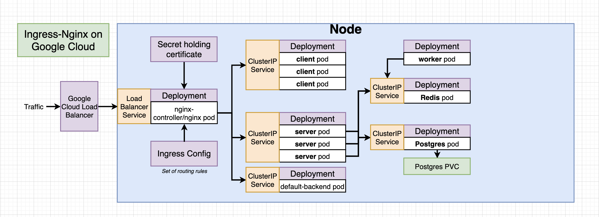

## App architecture



## App Setup

- Create an account on travis-CI (https://travis-ci.org/)
- Create an account google cloud(https://console.cloud.google.com/)
- Create k8s cluster on GKE
- Update `.travis.yml` accordingly.
- Add enviroment variables (DOCKER_USERNAME & DOCKER_PASSWORD) on travis-ci for this repo.
- Create require secret object on k8s cluster `kubectl create secret generic pgpassword --from-literal PGPASSWORD=<PSWD_VALUE>`
- Create GCP service-account credentials. Encrypt it with travis CLI & save it as `service-account.json.enc`

## HTTPS setup(SSL)

- Buy domain from domain service provider & setup DNS mapping
- Update domain name in `k8s/issuer.issuer.yaml` and `k8s/certificate.yaml` files
- Run following commands in k8s cluster
    ```
    # Install helm pkg manager:
    $ curl -fsSL -o get_helm.sh https://raw.githubusercontent.com/helm/helm/master/scripts/get-helm-3
    $ chmod 700 get_helm.sh
    $ ./get_helm.sh


    # Create the namespace for cert-manager:
    $ kubectl create namespace cert-manager


    # Add the Jetstack Helm repository & update local cache
    $ helm repo add jetstack https://charts.jetstack.io
    $ helm repo update


    # Install the cert-manager Helm chart:
    $ helm install cert-manager jetstack/cert-manager --namespace cert-manager --version v1.5.3 --create-namespace


    # Install the CRDs:
    $ kubectl apply -f https://github.com/jetstack/cert-manager/releases/download/v1.2.0/cert-manager.crds.yaml
    ```
